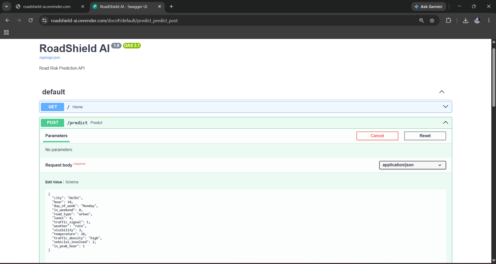
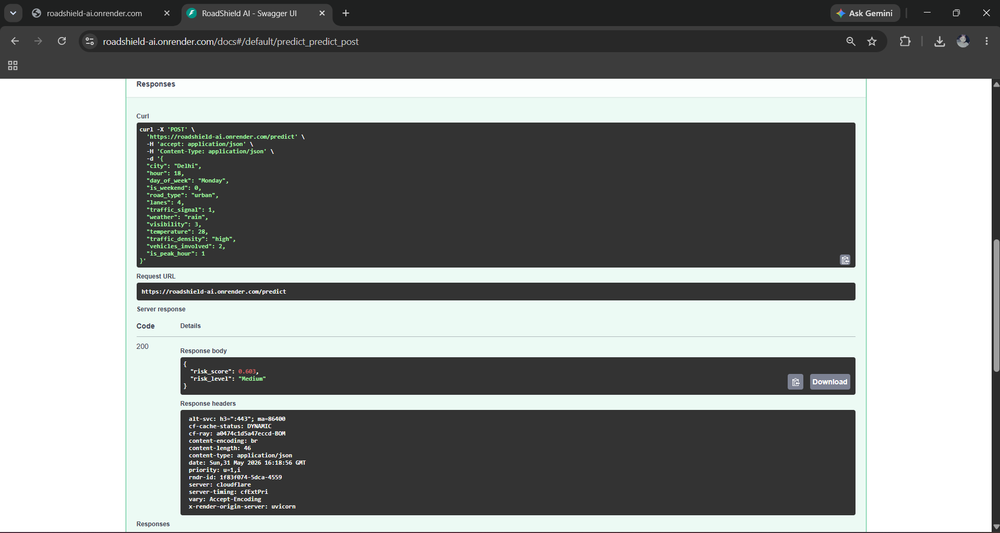
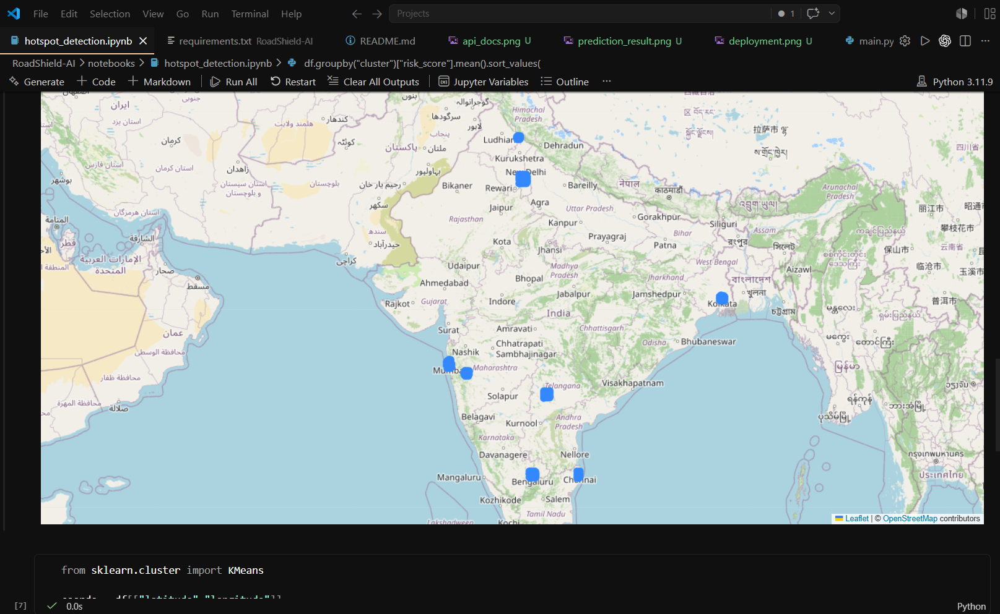
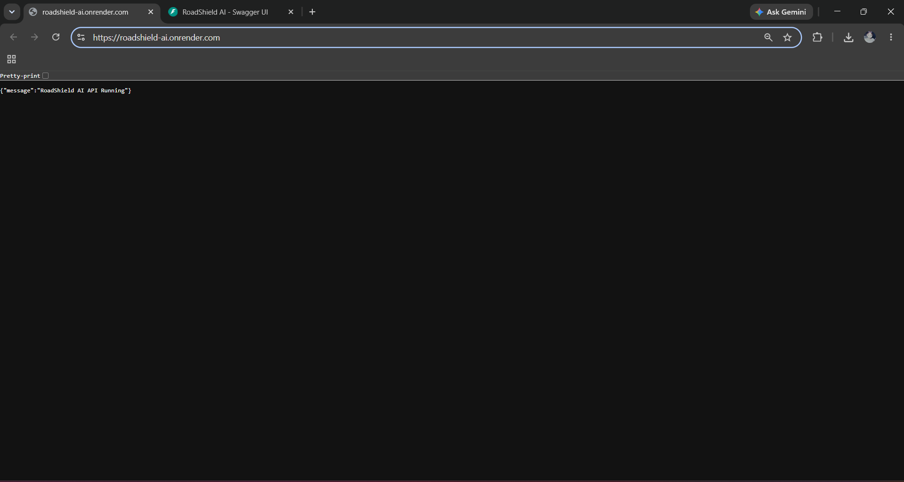

# RoadShield AI

AI-powered Road Risk Prediction and Hotspot Detection System for Indian Roads.

## Overview

RoadShield AI is a machine learning-based road safety platform that analyzes accident-related factors such as weather conditions, traffic density, visibility, road type, and peak-hour traffic to estimate road risk levels and identify accident hotspots.

The project aims to support road safety analysis, smart city planning, and accident prevention through predictive analytics and geospatial insights.

---

## Live Demo

### API Endpoint

https://roadshield-ai.onrender.com

### API Documentation

https://roadshield-ai.onrender.com/docs

---

## Features

* Road Risk Score Prediction using Machine Learning
* Accident Hotspot Detection using Clustering
* Exploratory Data Analysis (EDA)
* Feature Importance Analysis
* Interactive Geospatial Visualization
* FastAPI REST API
* Public Cloud Deployment (Render)
* Swagger API Documentation
* React Dashboard (Planned)

---

## Dataset

* Indian Road Accident Dataset (2022–2025)
* 20,000 accident records
* Multiple Indian cities
* Weather, traffic, visibility, road infrastructure, and temporal features
* Risk score information

---

## Machine Learning Results

### Risk Score Prediction

Model: Random Forest Regressor

Performance:

* R² Score: 0.88
* Mean Absolute Error (MAE): 0.056

### Most Important Features

| Feature         | Importance |
| --------------- | ---------- |
| Visibility      | 30.4%      |
| Traffic Density | 28.2%      |
| Weather         | 23.1%      |
| Peak Hour       | 8.0%       |
| Temperature     | 2.2%       |

---

## API Example

### Request

```json
{
  "city": "Delhi",
  "hour": 18,
  "day_of_week": "Monday",
  "is_weekend": 0,
  "road_type": "urban",
  "lanes": 4,
  "traffic_signal": 1,
  "weather": "rain",
  "visibility": 3,
  "temperature": 28,
  "traffic_density": "high",
  "vehicles_involved": 2,
  "is_peak_hour": 1
}
```

### Response

```json
{
  "risk_score": 0.603,
  "risk_level": "Medium"
}
```

---

## Project Structure

```text
RoadShield-AI/
│
├── backend/
├── frontend/
├── data/
├── docs/
├── models/
│   └── risk_model.pkl
├── notebooks/
│   ├── EDA.ipynb
│   ├── risk_model.ipynb
│   └── hotspot_detection.ipynb
├── screenshots/
├── README.md
└── requirements.txt
```

---
## Screenshots

### API Documentation


### Risk Prediction


### Hotspot Detection


### Deployment


## Project Status

✅ Data Collection

✅ Exploratory Data Analysis

✅ Risk Prediction Model

✅ Hotspot Detection

✅ FastAPI Backend

✅ Public API Deployment

✅ Swagger Documentation

🔄 React Dashboard

🔄 Real-Time Route Risk Prediction

🔄 Weather API Integration

---

## Future Improvements

* Real-time weather integration
* Live traffic APIs
* Interactive React dashboard
* City-wise risk analysis
* Route-level risk prediction
* GPS-based risk monitoring
* Docker deployment
* CI/CD pipeline

---

## Tech Stack

* Python
* Pandas
* NumPy
* Scikit-learn
* FastAPI
* Uvicorn
* Jupyter Notebook
* Folium
* Render
* React (Planned)

---

## Author

**Shivam Singh**

B.Tech CSE (AI & ML)

---

If you find this project useful, consider giving it a ⭐ on GitHub.
