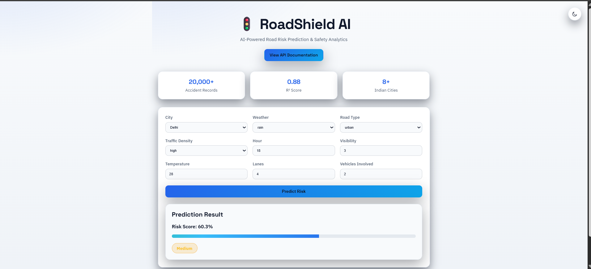
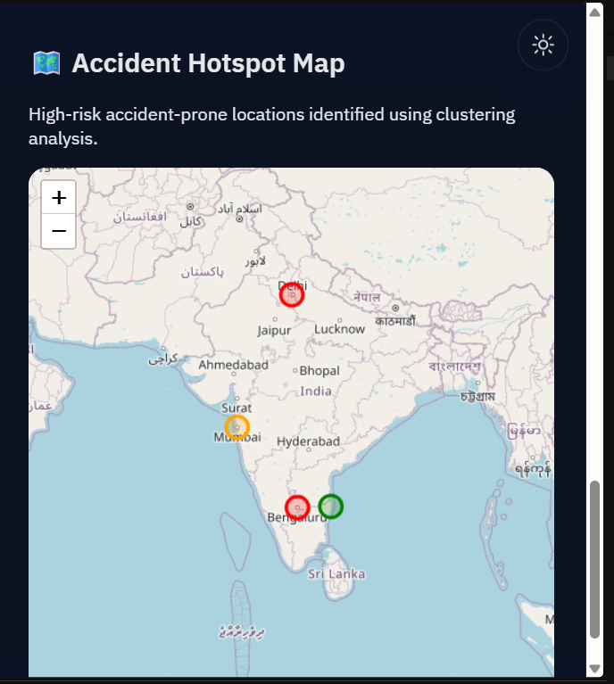
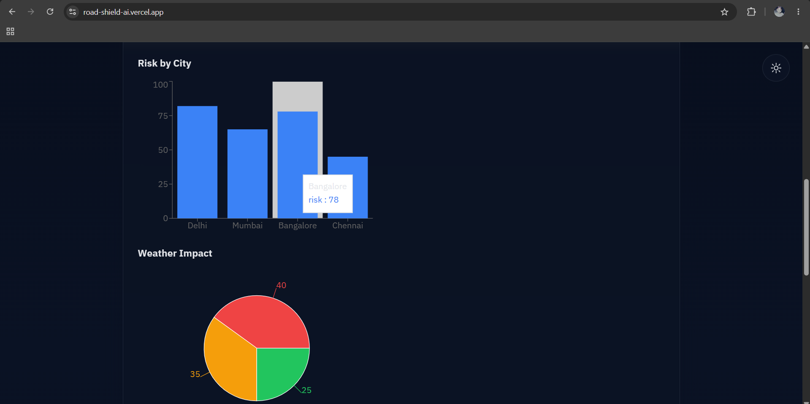

# RoadShield AI 🚦

AI-powered Road Risk Prediction and Hotspot Detection System for Indian Roads.


---

## Overview

RoadShield AI is a machine learning-powered road safety platform that analyzes accident-related factors such as weather conditions, traffic density, visibility, road type, temperature, and peak-hour traffic patterns to estimate road risk levels and identify accident hotspots.

The project combines Machine Learning, FastAPI, React, and Geospatial Visualization to support road safety analysis, smart city planning, and accident prevention through predictive analytics.

---

## Key Achievements

* Built and deployed a full-stack AI application using React and FastAPI
* Achieved an **R² Score of 0.88** using Random Forest Regression
* Developed and deployed REST APIs on Render
* Built a responsive dashboard with Dark/Light mode support
* Integrated frontend and backend through real-time prediction APIs
* Added interactive accident hotspot visualization using React Leaflet
* Deployed frontend on Vercel and backend on Render

---

## Live Demo

### Frontend Application

🔗 https://road-shield-ai.vercel.app

### Backend API

🔗 https://roadshield-ai.onrender.com

### API Documentation

🔗 https://roadshield-ai.onrender.com/docs

---

## Features

* Road Risk Score Prediction using Machine Learning
* Accident Hotspot Detection using Clustering
* Interactive Accident Hotspot Map
* Interactive Geospatial Visualization using React Leaflet
* Exploratory Data Analysis (EDA)
* Feature Importance Analysis
* FastAPI REST API
* React Frontend Dashboard
* Dark / Light Mode Support
* Real-Time Risk Prediction
* Public Cloud Deployment (Render + Vercel)
* Swagger API Documentation

---

## Dataset

* Indian Road Accident Dataset (2022–2025)
* 20,000 Accident Records
* Multiple Indian Cities
* Weather, Traffic, Visibility, Road Infrastructure, and Temporal Features
* Risk Score Information

---

## Machine Learning Results

### Risk Score Prediction

**Model:** Random Forest Regressor

### Performance

| Metric   | Value |
| -------- | ----- |
| R² Score | 0.88  |
| MAE      | 0.056 |

### Most Important Features

| Feature         | Importance |
| --------------- | ---------- |
| Visibility      | 30.4%      |
| Traffic Density | 28.2%      |
| Weather         | 23.1%      |
| Peak Hour       | 8.0%       |
| Temperature     | 2.2%       |

---

## API Example

### Request

```json
{
  "city": "Delhi",
  "hour": 18,
  "day_of_week": "Monday",
  "is_weekend": 0,
  "road_type": "urban",
  "lanes": 4,
  "traffic_signal": 1,
  "weather": "rain",
  "visibility": 3,
  "temperature": 28,
  "traffic_density": "high",
  "vehicles_involved": 2,
  "is_peak_hour": 1
}
```

### Response

```json
{
  "risk_score": 0.603,
  "risk_level": "Medium"
}
```

---

## Screenshots

### Dashboard (Dark Mode)



### Dashboard (Light Mode)


### API Documentation


### Accident Hotspot Detection


### Interactive Hotspot Map



### Risk Analytics Dashboard



---

## Project Structure

```text
RoadShield-AI/
│
├── backend/
│   ├── main.py
│   ├── schemas.py
│   ├── encoders.py
│   ├── model_loader.py
│   └── requirements.txt
│
├── frontend/
│   ├── src/
│   ├── public/
│   ├── components/
│   └── package.json
│
├── data/
├── docs/
├── models/
│   └── risk_model.pkl
│
├── notebooks/
│   ├── EDA.ipynb
│   ├── risk_model.ipynb
│   └── hotspot_detection.ipynb
│
├── screenshots/
│
├── render.yaml
├── README.md
└── requirements.txt
```

---

## Local Setup

### Clone Repository

```bash
git clone https://github.com/shivaamsingh/RoadShield-AI.git
cd RoadShield-AI
```

### Backend Setup

```bash
pip install -r requirements.txt
uvicorn backend.main:app --reload
```

Backend:

```text
http://localhost:8000
```

API Documentation:

```text
http://localhost:8000/docs
```

### Frontend Setup

```bash
cd frontend
npm install
npm install react-leaflet leaflet
npm run dev
```

Frontend:

```text
http://localhost:5173
```

### Production Deployment

Frontend (Vercel)

```text
https://road-shield-odtoybjiy-shiivamsingh.vercel.app
```

Backend (Render)

```text
https://roadshield-ai.onrender.com
```

---

## Project Status

✅ Data Collection

✅ Exploratory Data Analysis

✅ Risk Prediction Model

✅ Accident Hotspot Detection

✅ FastAPI Backend

✅ React Frontend Dashboard

✅ Interactive Hotspot Map

✅ Dark / Light Mode Support

✅ Public API Deployment

✅ Swagger API Documentation

✅ Frontend Deployment (Vercel)

🔄 Real-Time Route Risk Prediction

🔄 Weather API Integration

🔄 Live Traffic Analytics

---

## Future Improvements

* Real-time Weather API Integration
* Live Traffic Data Integration
* Route-Level Risk Prediction
* City-Wise Risk Analytics Dashboard
* GPS-Based Risk Monitoring
* Mobile Application
* Docker Deployment
* CI/CD Pipeline
* User Authentication
* Historical Risk Trend Analysis

---

## Tech Stack

### Backend

* Python
* FastAPI
* Uvicorn

### Machine Learning

* Pandas
* NumPy
* Scikit-Learn

### Frontend

* React
* Vite
* Axios
* React Leaflet
* Modern Responsive UI
* Dark / Light Mode

### Visualization

* Folium
* React Leaflet

### Deployment

* Render
* Vercel

---

## Author

### Shivam Singh

B.Tech CSE (AI & ML)

GitHub Profile: [@shivaamsingh](https://github.com/shivaamsingh)

Project Repository: [RoadShield-AI](https://github.com/shivaamsingh/RoadShield-AI)

---

⭐ If you found this project useful, please consider starring the repository.

Contributions, suggestions, and feedback are welcome.
